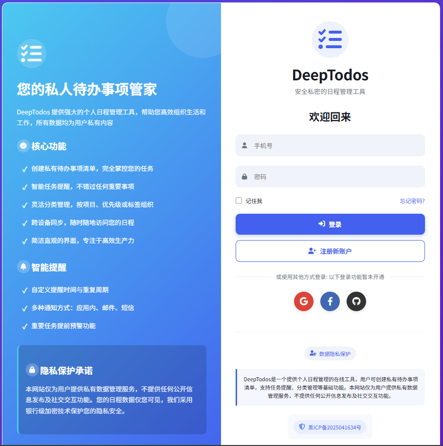
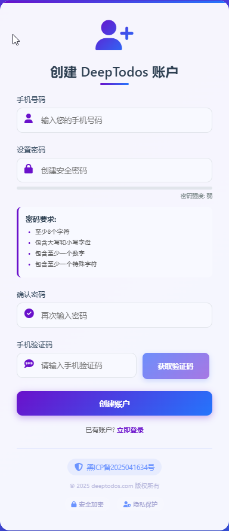
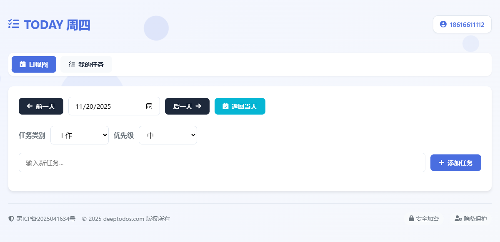

# 📝 DeepTodos
[](https://opensource.org/licenses/MIT)
[](https://github.com/Jarod-father/DeepTodos/releases)

A to-do list helps you plan your daily life and work. It allows you to organize tasks, set priorities, and track progress. By using a to-do list, you can manage your time more effectively and ensure that important tasks are completed.

## 🧩 Features 
- ✅ Add, Delete, Task
- ✅ Task status indicator (completed / not completed)

## 🔫 Quick Start 
### Precondition
- **Python 3.13+** (Recommend using Python 3.13.2 or a later version)
- **pip 24.3+** (Recommend using pip 24.3.1 or a later version)
- **Node.js 22.18+** (Recommend using Node.js 22.18.0 or a later version)
- **Git 2.38+** (Recommend using Git 2.38.1 or a later version)
- **VSCode** 
### Installation and operation
#### Cloning project
```
git clone https://github.com/Jarod-father/DeepTodos.git
cd deeptodos
```
#### Install dependencies
```
pip install -r requirements.txt
```
#### Start the Application
Run the Python file "app.py" in VSCode
#### Open your browser and visit http://localhost:5000

## 🖱️ Usage 
Login Page<br>
<br>
Register Page<br>
<br>
Maintain Tasks<br>
<br>

## ✊ Technology Stack 
- **Python**
- **HTML**
- **CSS**
- **SQLite**

## 🚧 Project Structure 


## 👩‍💻 Development and Contributing 
- Create a branch: For example: dev
- After the code has been modified, open the Terminal in the root directory ./deeptodo
- git status // Check the Git status
- git checkout dev // Switch to the branch "dev"
- git add . 
- git commit -m "message"
- git push origin dev
- merge dev to main branch

## ⚖️ License 
[MIT](https://choosealicense.com/licenses/mit/)